---

### 🧠 About Me

- ⚡ GenAI Engineer, learning by building real systems
- 🤖 Working with agentic AI, RAG pipelines, and LLM-based backends
- 🧩 Enjoy figuring out how the pieces of a system work together
- 🚀 Focused on writing backend code that's clean and actually works
- 🌱 Always learning, always building

---

### ⚙️ Tech Stack

---

### 📊 GitHub Stats

---

### 🗳️ LeetCode Stats

---

### 📅 Contribution Calendar

---

### 📈 Contribution Activity Graph

